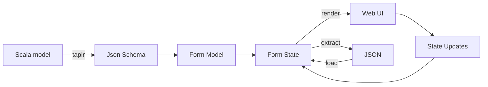

# Intro

**forms4s** is a Scala library for building user interfaces from data models and JSON Schema. It provides a type-safe way to define, render, and manage forms in Scala applications.

## Features

- **Generate UI components** - Create UI components (e.g., for Tyrian) from structured schemas
- **JSON Schema integration** - Derive form structure directly from JSON Schema
- **JSON data extraction** - Extract user input as JSON data
- **JSON data hydration** - Fill the form with JSON data
- **Validation** - Validate form input based on schema constraints or custom logic

