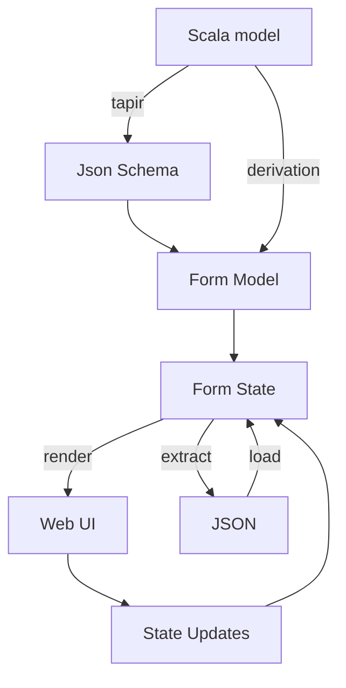
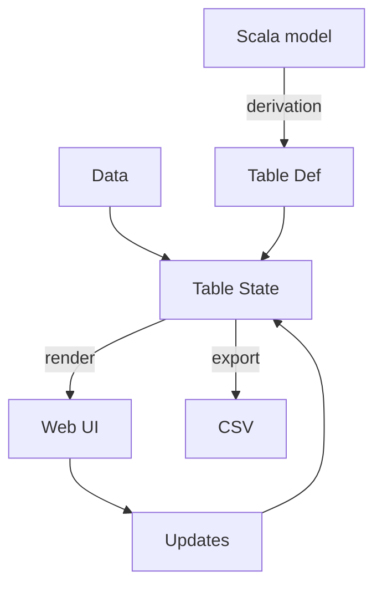

# Introduction

**forms4s** is a Scala library for building user interfaces from data models. It provides type-safe components for:

- **[Forms](./forms/getting-started)** - Build forms from Scala types or JSON Schema with automatic rendering and validation
- **[Datatables](./datatables/)** - Display, filter, sort, and export tabular data

Try the **[interactive demo](/demo)** to see forms4s in action.

## Features

### Forms
- Generic form model derived from Scala types or JSON Schema
- Multiple CSS framework support (Bulma, Bootstrap, Pico)
- JSON data extraction and hydration
- Schema-based validation

### Datatables
- Column-based filtering (text, select, range, boolean)
- Sorting and pagination
- Row selection
- CSV export

